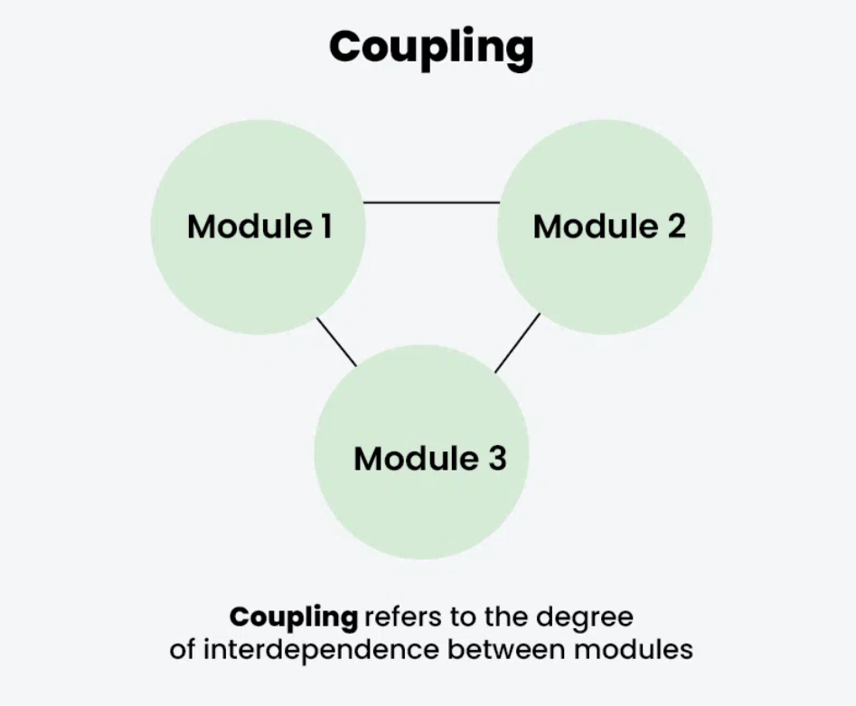
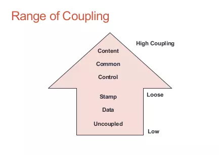
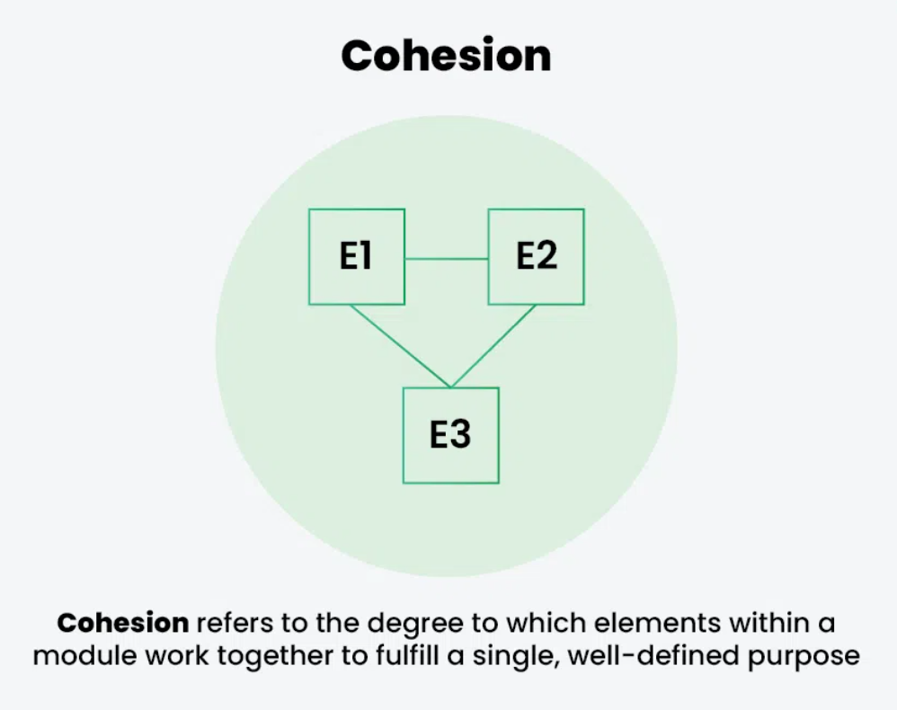
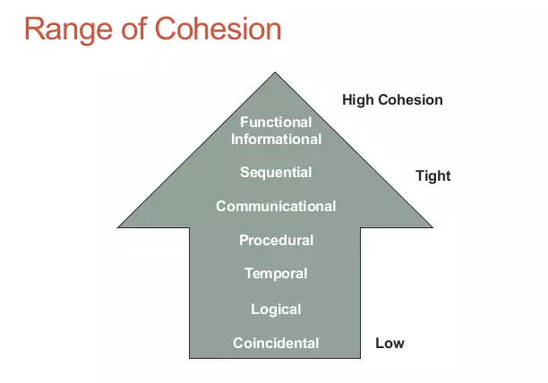

# Coupling

📘 Mức độ phụ thuộc lẫn nhau giữa các modun.
👉 Coupling cao có nghĩa là các mô-đun được kết nối chặt chẽ và những thay đổi trong một mô-đun có thể ảnh hưởng đến các mô-đun khác.
👉 Coupling thấp có nghĩa là các mô-đun độc lập và những thay đổi trong một mô-đun có ít tác động đến các mô-đun khác.

## Coupling levels

| STT | Type                                                   | Nội dung                                                                                                                                                           |
| --- | ------------------------------------------------------ | ------------------------------------------------------------------------------------------------------------------------------------------------------------------ |
| 1   | <b>Content coupling</b> | Một component có thể truy cập trực tiếp vào hoạt động bên trong của một component khác ví dụ như trực tiếp truy xuất data (attribute), thay đổi data của component |
| 2   | <b>Common coupling</b>  | 2 hay nhiều module cùng đọc và thay đổi 1 dữ liệu dùng chung                                                                                                       |
| 3   | <b>Control coupling</b> | Xảy ra khi mà tham số truyền vào cho module sẽ quyết định luồng xử lý của module theo những cách khác nhau (truyền param, if-else thay đổi flow xử lý)             |
| 4   | <b>Stamp coupling</b> | Tham số truyền vào cho module là thừa                                                                                                                              |
| 5   | <b>Data coupling</b>  | Các modules tương tác với nhau chỉ thông qua tham số truyền vào                                                                                                    |

---

# Cohesion

📘 Mức độ mà các yếu tố trong một mô-đun phối hợp với nhau để hoàn thành một mục đích duy nhất, được xác định rõ ràng.
👉 Cohesion cao có nghĩa là các yếu tố có mối liên hệ chặt chẽ và tập trung vào một mục đích duy nhất.
👉 Cohesion thấp có nghĩa là các yếu tố có mối liên hệ lỏng lẻo và phục vụ nhiều mục đích khác nhau.

## Coupling levels

| STT | Type                                                             | Nội dung                                                                                                                                                                                                                                                                        |
| --- | ---------------------------------------------------------------- | ------------------------------------------------------------------------------------------------------------------------------------------------------------------------------------------------------------------------------------------------------------------------------- |
| 1   | <b>Coincidental</b>               | Những elements nằm trong component một cách lạc lõng và đơn độc, nó chỉ có điểm chung là nằm chung vị trí với các component khác chứ không liên quan đến mục tiêu thể hiện của component. Những elements này không hề có tính liên kết gì với các elements khác trong component |
| 2   | <b>Logical cohesion</b>           | Được định nghĩa là khi các components liên quan đến nhau một cách logic chứ không phải là liên quan với nhau theo chức năng                                                                                                                                                     |
| 3   | <b>Temporal cohesion</b>          | Những elements liên quan đến nhau theo thời gian chứ không theo chức năng và những elements này được thực thi gần như trong cùng một khoảng thời gian                                                                                                                           |
| 4   | <b>Procedural cohesion</b>        | Những elements liên quan đến nhau chỉ để đảm bảo một thứ tự thực thi cụ thể                                                                                                                                                                                                     |
| 5   | <b>Communicational cohesion</b> | Là một nhóm các elements của module cùng hoạt động trên cùng một data                                                                                                                                                                                                           |
| 6   | <b>Sequential Cohesion</b>      | Khi output của một element trở thành input của một element khác, tức là dữ liệu được truyền giữa các phần                                                                                                                                                                       |
| 7   | <b>Functional cohesion</b>      | Đây là mức cao nhất của cohesion khi mà tất cả các elements trong component đều là cần thiết cho mục đích của component                                                                                                                                                         |
