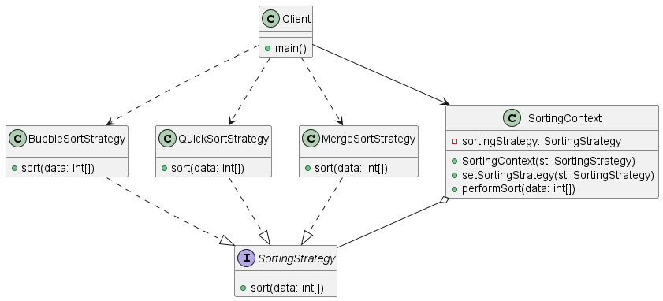

# Strategy

## Dùng khi nào:

- Khi có **nhiều thuật toán / hành vi** khác nhau cho cùng một nhiệm vụ
- Khi muốn **thay đổi hành vi trong runtime** mà không sửa code client
- Khi có nhiều `if / else` hoặc `switch` dựa trên loại hành vi

## Lợi ích:

- Tuân thủ **Open/Closed Principle**
- Dễ mở rộng, thêm strategy mới
- Giảm điều kiện rẽ nhánh phức tạp
- Có thể **thay đổi strategy tại runtime**

## Hạn chế:

- Tăng số lượng class
- Client cần biết và chọn strategy phù hợp

## Sample

### 🏛️Class diagram

### 💻 Code

#### 🐍 python

[strategy.py](../../Code/python/BehavioralDesignPatterns/Strategy/strategy.py)
